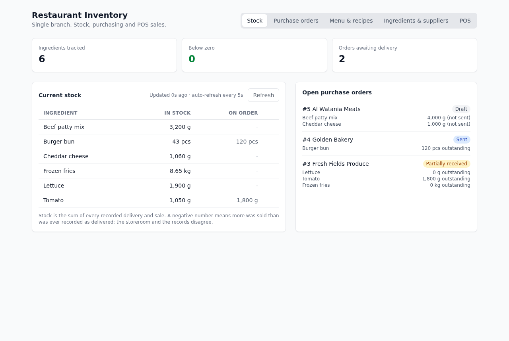
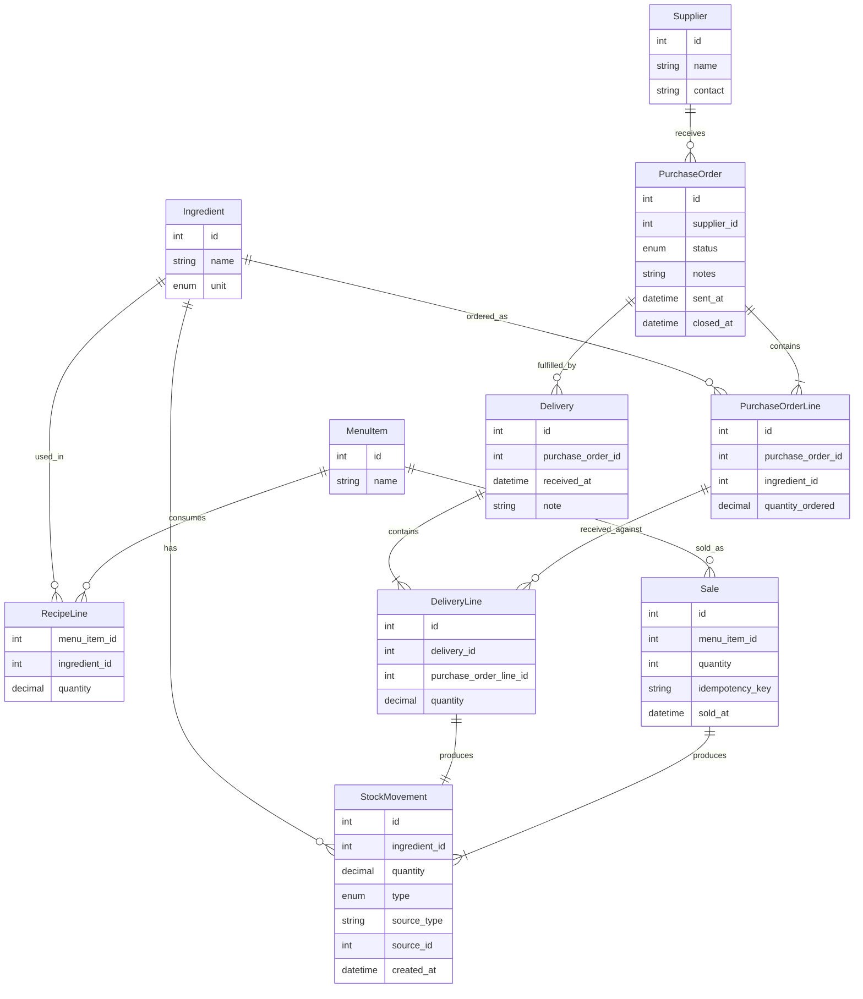
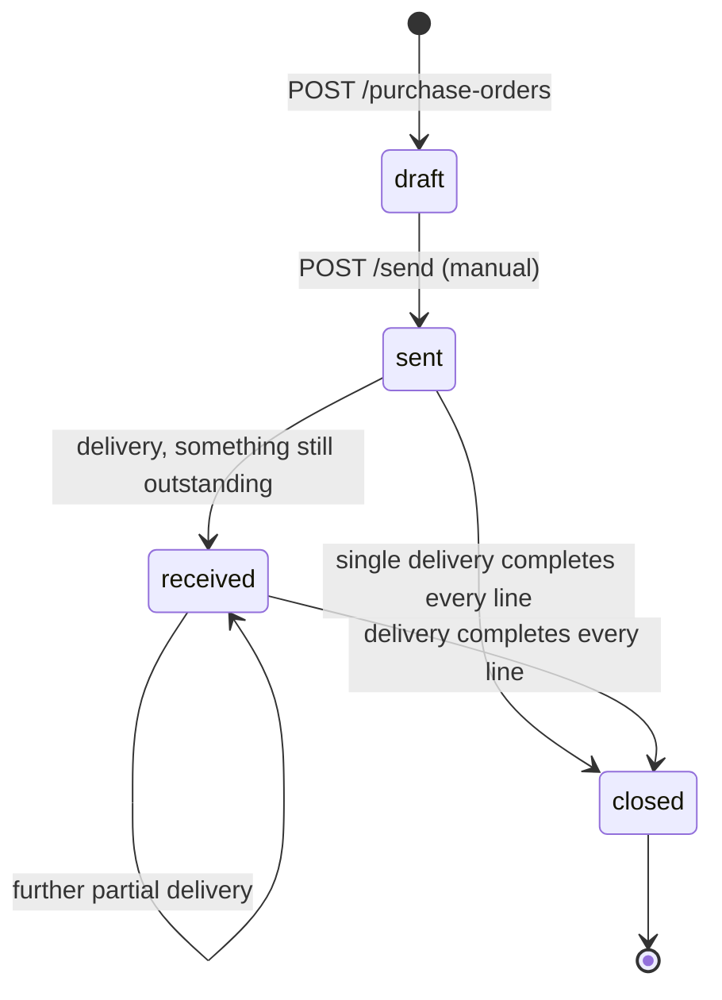

# Restaurant Inventory Service

Inventory and purchasing service for a single-branch restaurant: ingredients
and suppliers, menu items with recipes, purchase orders with a strict
lifecycle, partial deliveries, a POS sale endpoint that consumes stock per
recipe, and a dashboard that shows current stock and open orders and keeps
itself fresh.

Built for the Foodics ERP build challenge. Laravel 13 / PHP 8.5 JSON API,
React + TypeScript UI that talks only to that API, SQLite, Pest. Everything
runs in Docker; nothing is installed on the host.



## Quick start

Prerequisites: Docker Desktop (or Docker Engine with Compose v2). That is all.

```sh
git clone <repo-url> restaurant-inventory-service
cd restaurant-inventory-service
make up
```

`make up` builds the image, installs Composer and npm dependencies inside the
container, creates the SQLite database, migrates, seeds a burger-restaurant
scenario and starts the API on http://localhost:8000 (Vite dev server with
HMR on :5173). First boot takes a couple of minutes while dependencies
install; later starts take about 30 seconds.

```sh
make test                      # full suite (Pest, in-memory SQLite)
make test-filter F=delivery    # tests whose name matches
make fresh                     # drop, migrate and reseed
make logs                      # tail both containers
make artisan A="route:list"    # any artisan command
make shell                     # bash inside the app container
make down                      # stop
make help                      # every target
```

## Features

| Brief item | What exists | Endpoints |
| --- | --- | --- |
| Ingredients and suppliers | Ingredient has a name and a fixed unit (`g`, `kg`, `ml`, `l`, `pcs`); supplier has a name and optional contact. | `GET/POST /api/ingredients`, `GET/POST /api/suppliers` |
| Recipes / menu items | A menu item has one recipe: a list of `(ingredient, quantity)` lines in each ingredient's own unit. The recipe can be replaced wholesale. | `GET/POST /api/menu-items`, `GET /api/menu-items/{id}`, `PUT /api/menu-items/{id}/recipe` |
| Purchase orders | Created as a draft with its lines, sent to the supplier, then driven to `received` / `closed` by deliveries. Invalid moves are rejected with 409. | `GET/POST /api/purchase-orders`, `GET .../{id}`, `POST .../{id}/send` |
| Deliveries | Recorded against a sent or partially received order; partial quantities allowed; stock rises by exactly what arrived; the order closes itself when every line is fully received. Over-receipt is a 422. | `POST /api/purchase-orders/{id}/deliveries` |
| POS sales | "Sold N of menu item X" writes one negative stock movement per recipe line. Stock may go negative; the response carries warnings. Optional idempotency key makes retries safe. | `POST /api/sales`, `GET /api/sales` |
| Visibility | Per-ingredient current stock with a negative flag and quantity on order; open orders with outstanding per line. The UI polls every 5 seconds and refetches after every mutation, showing "Updated Ns ago". | `GET /api/stock`, `GET /api/purchase-orders?open=1` |

The UI has five tabs (Stock, Purchase orders, Menu & recipes, Ingredients &
suppliers, POS) and is served from a single Blade view at `/`. It uses the
same `/api/*` routes as an external POS would; there is no UI-only endpoint.

## Data model



### Stock is a ledger, not a number

Nothing in the schema stores "current stock". Every stock change is an
immutable `stock_movements` row: positive for a delivery line, negative for a
sale, with a `type` and a polymorphic `source` pointing at the delivery line
or sale that caused it. Current stock is `SUM(quantity)` per ingredient
(`Ingredient::withCurrentStock()`), and a purchase order line's received
quantity is `SUM(delivery_lines.quantity)`, with `outstanding = ordered -
received`.

Why I chose this over an `ingredients.stock` column:

- A number with no history cannot be explained or repaired. With the ledger
  "stock is always right" is a tautology: it is the sum of recorded facts.
- Read-modify-write races disappear; inserting a row is commutative.
- Every plausible next feature (adjustments, waste, recounts, history,
  audit, reorder suggestions) is a new movement type or a query over the
  ledger, not a schema change.

The cost is an aggregate on read, which is trivial at restaurant scale. If it
ever mattered, a cached column rebuilt from the ledger is a well-understood
optimisation.

Quantities are `decimal(12,3)` in the ingredient's own unit. Arithmetic that
decides outcomes (outstanding, over-receipt, negative stock) uses `bcmath`
with 3-decimal scale so `0.1 + 0.2` never becomes a bug.

## Purchase order lifecycle



The brief lists `draft -> sent -> received -> closed` and asks that only valid
moves be allowed. I read it literally:

- `draft`: created with its lines, nothing ordered yet. The only manual
  transition is `draft -> sent`.
- `sent`: at the supplier, deliveries accepted, nothing received yet.
- `received`: at least one delivery recorded but some line still has
  outstanding quantity. The UI labels it **Partially received**, because
  "received" alone reads like "done".
- `closed`: every line fully received. Terminal. Set automatically by the
  delivery that completes the order, never by hand.

The enum `PurchaseOrderStatus` knows exactly three edges (`draft -> sent`,
`sent -> received`, `received -> closed`) and `PurchaseOrder::transitionTo()`
is the only code path that changes the column; anything else throws
`InvalidStateTransition`, rendered as **409**:

```json
{"message":"Purchase order #3 cannot move from received to sent.","error":"invalid_state_transition","from":"received","to":"sent"}
```

A single delivery that completes a `sent` order passes through `received`
and `closed` as two valid hops inside one transaction, so the state machine
never needs a shortcut edge. "Open" orders are everything that is not
`closed`; deliveries are only accepted for `sent` and `received` orders
(409 otherwise).

## API

All routes are under `/api`, JSON in and out, no authentication (see
decisions). Validation failures are Laravel's standard **422** shape; business
rule violations are `App\Exceptions\DomainException` subclasses rendered as
JSON with a stable `error` code:

| Code | Status | When |
| --- | --- | --- |
| `invalid_state_transition` | 409 | Sending a non-draft order; delivering against a draft or closed order |
| `over_receipt` | 422 | A delivery line exceeds the line's outstanding quantity (includes `purchase_order_line_id`, `outstanding`, `requested`) |
| `line_not_in_order` | 422 | A delivery references a line from another order |
| `empty_recipe` | 422 | Selling a menu item that has no recipe |

Endpoints:

| Method | Path | Notes |
| --- | --- | --- |
| GET, POST | `/api/ingredients` | `{name, unit}` |
| GET, POST | `/api/suppliers` | `{name, contact?}` |
| GET, POST | `/api/menu-items` | `{name, lines: [{ingredient_id, quantity}]}` |
| GET | `/api/menu-items/{id}` | With recipe |
| PUT | `/api/menu-items/{id}/recipe` | Replaces all lines |
| GET, POST | `/api/purchase-orders` | `?open=1` filters out closed. Create: `{supplier_id, notes?, lines: [...]}` -> draft |
| GET | `/api/purchase-orders/{id}` | Lines with `quantity_received` and `outstanding`, plus deliveries |
| POST | `/api/purchase-orders/{id}/send` | `draft -> sent` |
| POST | `/api/purchase-orders/{id}/deliveries` | `{lines: [{purchase_order_line_id, quantity}], received_at?, note?}`; returns the updated order |
| GET | `/api/stock` | Per ingredient: `current_stock`, `is_negative`, `on_order` |
| GET, POST | `/api/sales` | `{menu_item_id, quantity, idempotency_key?, sold_at?}` |

A sale, as a POS would send it (the seed gives Classic Burger the id `1`):

```sh
curl -s -X POST http://localhost:8000/api/sales \
  -H 'Content-Type: application/json' \
  -d '{"menu_item_id": 1, "quantity": 2, "idempotency_key": "ticket-1042"}'
```

```json
{
  "data": { "id": 4, "menu_item_id": 1, "menu_item_name": "Classic Burger", "quantity": 2, "idempotency_key": "ticket-1042", "sold_at": "...", "movements": [ ... ] },
  "consumed": [
    { "ingredient_id": 1, "ingredient_name": "Beef patty mix", "unit": "g", "quantity": 300, "stock_after": 2900 },
    { "ingredient_id": 2, "ingredient_name": "Burger bun", "unit": "pcs", "quantity": 2, "stock_after": 41 },
    { "ingredient_id": 3, "ingredient_name": "Cheddar cheese", "unit": "g", "quantity": 40, "stock_after": 1020 }
  ],
  "warnings": [],
  "replayed": false
}
```

`201` on first write; sending the same `idempotency_key` again returns `200`
with `"replayed": true` and changes nothing. If any `stock_after` is below
zero, `warnings` lists that ingredient. Watch the Stock tab while running the
command: the row updates within five seconds.

## Decisions on the open-ended parts

What I chose, and why.

- **Meaning of `received` vs `closed`.** `received` means partially received and `closed` means fully received, set automatically, because a manual close can hide goods that are still outstanding.
- **Over-delivery.** A delivery line above the outstanding quantity is a 422 and nothing is written, because otherwise "fully received" has no clean definition and the order cannot know when to close.
- **Selling with insufficient stock.** The sale is accepted, stock may go negative, and the response carries `warnings` with the row painted red, because the sale has already happened at the till. The alternative I would add next is an `allow_negative_stock` flag so a restaurant can reject the sale instead; it is listed below.
- **Stock representation.** An immutable movement ledger, with stock derived from it. The reason is in the data model section.
- **Deliveries not tied to an order.** Every delivery is against a sent or received order and its lines, because that is what makes outstanding and closed computable. An ad-hoc purchase would be a positive `adjustment` movement, which is a later feature.
- **Units.** A fixed enum per ingredient and no conversion; recipes and orders use the ingredient's own unit, because density and pack sizes are outside this brief. Integer milli-units were the other way to keep the arithmetic exact.
- **Editing orders and recipes.** A draft is created with its lines in one request and cannot be edited or deleted in v1, and a recipe is replaced with a full `PUT`, because movements store concrete quantities and editing a recipe must not rewrite history.
- **Freshness.** Poll every 5 seconds, refetch immediately after a mutation, and show "Updated Ns ago", because `php artisan serve` is a single process and a long-lived SSE or websocket connection would block it.
- **Authentication.** None. The brief does not ask for it, and an open API lets a reviewer `curl` a sale during a demo.
- **Idempotent sales.** `POST /sales` takes an optional `idempotency_key`; a repeat returns the original sale with `200` and no new movements, because a POS retry on timeout would otherwise count the sale twice.

## Architecture notes

**Shape.** Idiomatic Laravel with a thin domain layer, deliberately not full
hexagonal. Controllers validate with Form Requests, call a single-purpose
invokable Action (`app/Actions/{SendPurchaseOrder, RecordDelivery,
RecordSale}`) wrapped in `DB::transaction`, and return an API Resource.
Models hold relationships, casts and scopes. Business rules throw
`DomainException` subclasses and `bootstrap/app.php` renders them as JSON, so
Actions never build HTTP responses. Three Actions carry every invariant that
matters, which keeps the live-extension surface small: a new feature is a
new enum value, one Action, one controller method, one Resource field and
one form.

**Why not the official Laravel React starter kit.** I considered it because
it is the idiomatic Laravel + React path and I would reach for it on a
product with auth and server-driven pages. For this brief it was the wrong
tool: the kit is Inertia-based, so the UI would receive server-rendered props
rather than "use the API" as the brief requires; it ships Fortify with 2FA,
email verification and settings pages that are out of scope and would take
longer to remove than they save; and I want to own every line I present. The
app is the plain `laravel/laravel` skeleton with `react`, `react-dom`,
TypeScript and TanStack Query added, one Blade view mounting `#root`, and a
typed API client in `resources/js/api`.

**Concurrency.** Every write that touches stock or an order status runs in a
transaction and takes `lockForUpdate()` on the order or ingredient rows.
SQLite serialises writers anyway; on MySQL or Postgres the row locks make
concurrent deliveries and sales serialise on the rows they share. Over-receipt
is validated for every line before anything is written, so a bad line
rejects the whole delivery.

**SQLite.** Chosen so `make up` is the only command and tests run in-memory
in under a second. `decimal(12,3)` is REAL in SQLite, exact for the
3-decimal range at this scale; it would be a true `DECIMAL` on MySQL, and
all decision-making arithmetic goes through `bcmath` on strings regardless.

**Docker.** One image (`php:8.5-cli` + Composer + Node 24), two Compose
services sharing the bind-mounted source: `app` runs the entrypoint
(install if `vendor/` missing, `.env`, key, SQLite file, migrate, seed) then
`artisan serve`; `vite` runs the dev server with HMR. Vite dev assets are
used when the `public/hot` file exists, otherwise the built bundle in
`public/build` (`make build`).

## Testing

75 tests, 312 assertions, about one second (`make test`). Pest 4 with
`RefreshDatabase` on in-memory SQLite.

- `tests/Unit/PurchaseOrderStatusTest.php`: every one of the 16 `(from, to)`
  pairs, so no shortcut edge can appear unnoticed.
- `tests/Feature/Api/DeliveriesTest.php` is the heart of the grade: partial
  delivery keeps outstanding and moves `sent -> received`; the completing
  delivery closes; one full delivery goes `sent -> closed`; over-receipt is
  422 and writes nothing (movement and delivery counts asserted unchanged);
  delivery against draft/closed is 409; a line from another order is 422;
  stock equals the sum of deliveries.
- `SalesTest.php`: two Classic Burgers create exactly three movements of
  300/2/40; empty recipe 422; quantity 0 422; negative stock is persisted
  and returns a warning; idempotency key replays with 200 and no movements.
- `PurchaseOrdersTest.php`, `MenuItemsTest.php`, `IngredientsTest.php`,
  `SuppliersTest.php`: happy path and each rejected path for every write
  endpoint (validation, duplicates, unknown references, send twice).
- `StockTest.php`: stock reflects deliveries minus sales; `on_order` counts
  only sent/received orders; `?open=1` excludes closed and reports
  outstanding.

Run a subset with `make test-filter F="partial delivery"`. There are no
frontend tests; the UI was verified end to end in a headless browser (see the
AI log) and by hand.

## How I used AI

Planning was a chat conversation, before any code and before Cursor: a plan only, no code. Two calls came back wrong. It had a person pressing "close" on a purchase order; an order closes when the quantities say everything arrived, otherwise goods still outstanding disappear. It rejected a sale when the books said stock was short; a sale has already happened at the till, and if the count goes negative that is the recount signal. I also asked about the official React starter kit, which is what I would normally start from. It brings Inertia and a pile of auth pages, and the UI would not be calling the API the POS calls, so I dropped it. After that I wrote the plan down. Cursor was the implementation pair from the first slice on. Full session notes in [docs/ai-log.md](docs/ai-log.md).

## What I would do next

In order:

1. **Manual stock adjustments and recounts** (`type = adjustment` with a
   reason). This is the fix path for negative stock and for the ad-hoc cash
   purchase; the ledger already supports it.
2. **Configurable negative-stock policy**: an `allow_negative_stock` setting
   so a restaurant can choose "reject the sale" instead of "accept and
   flag". The check and the exception type already exist; it is a flag and
   a test.
3. **Per-ingredient movement history** (`GET /ingredients/{id}/movements`)
   as an expandable row in the stock table. Free given the ledger.
4. **Push freshness** with Laravel Reverb or SSE behind a real web server,
   replacing the 5-second poll.
5. **Low-stock threshold per ingredient** with an amber badge and reorder
   suggestions from recipe consumption.
6. **Cached stock column** rebuilt from the ledger, if read volume ever made
   the aggregate matter.
